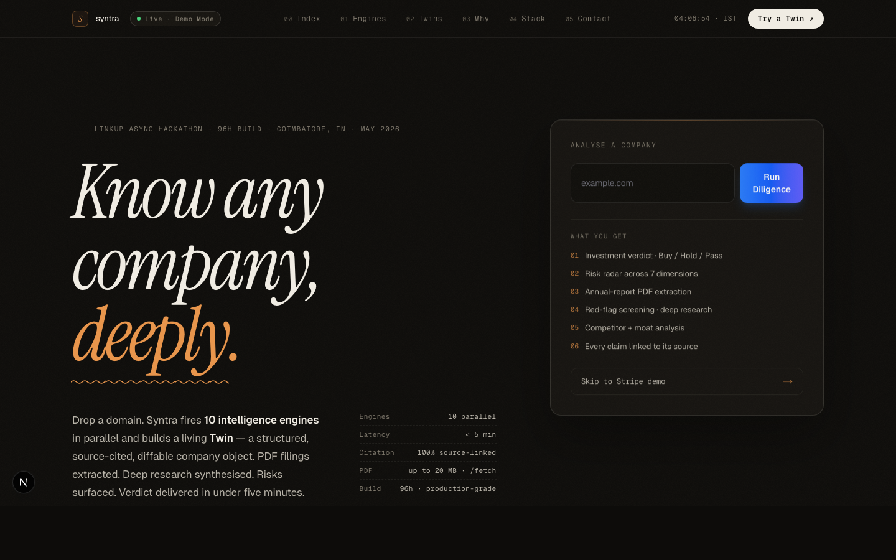
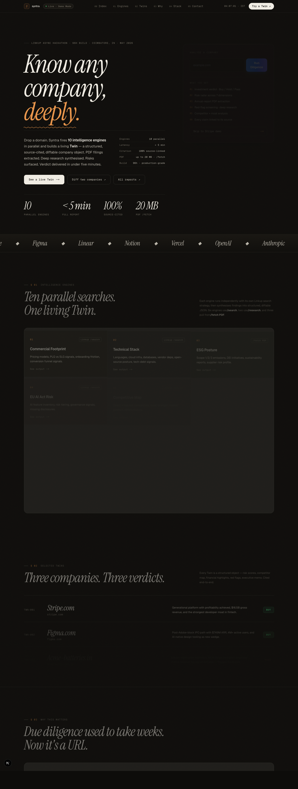
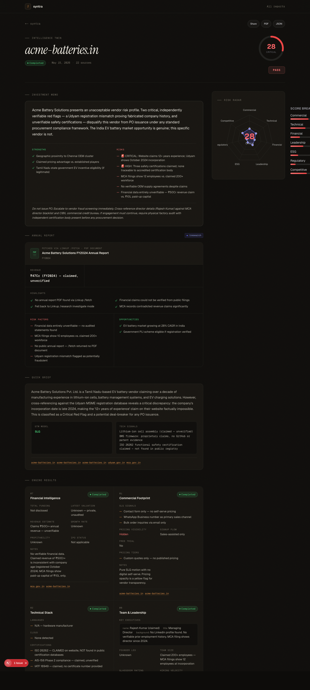
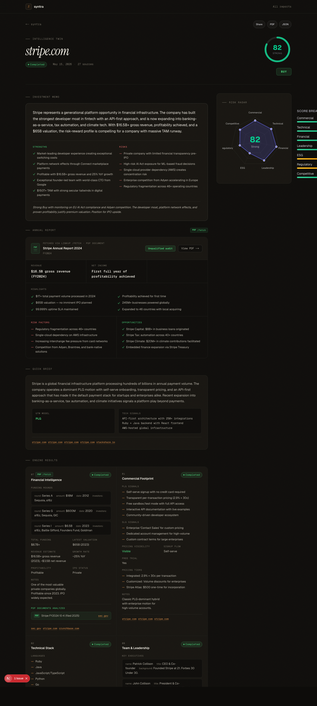
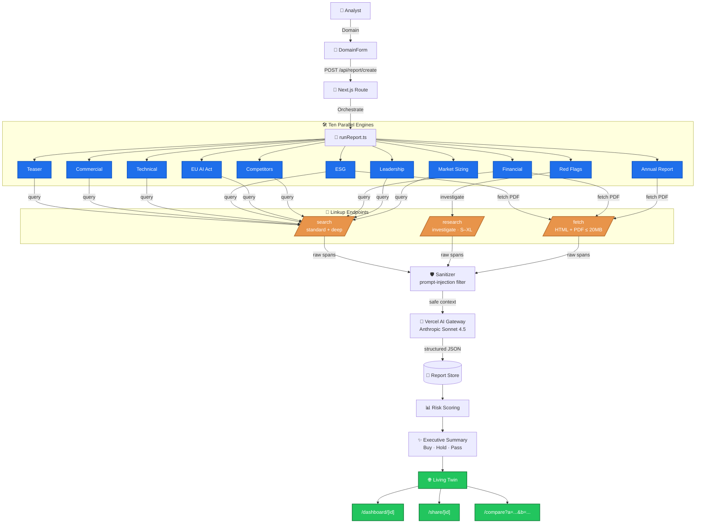
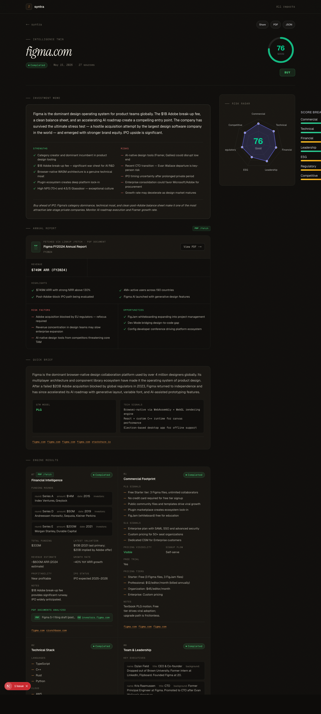
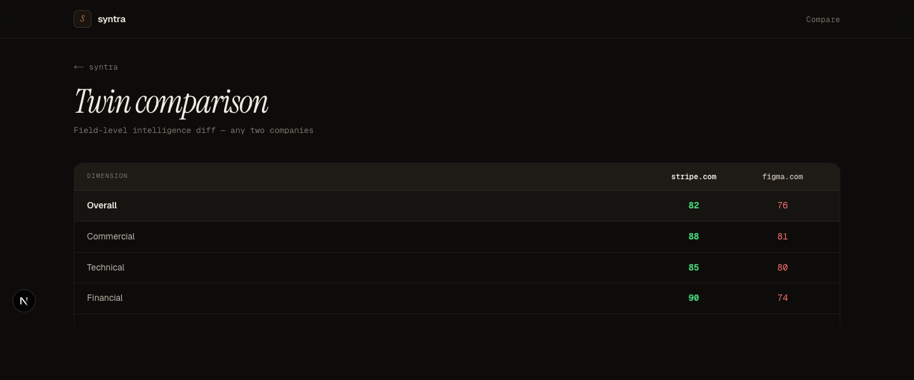
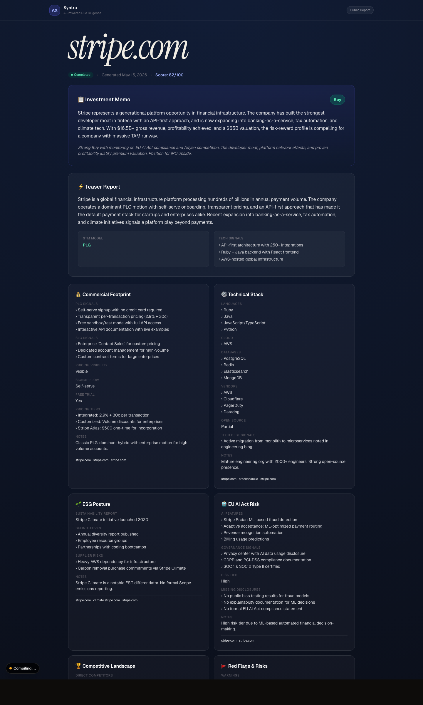
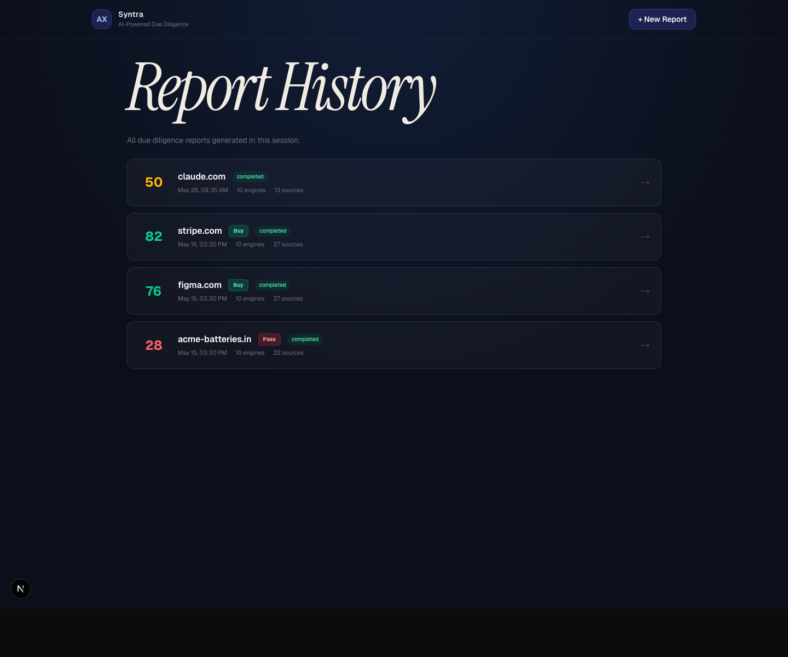

<div align="center">


# Syntra

### Intelligence Twins for Modern M&A

**Drop a domain. Ten parallel Linkup engines fire. A living, source-cited, diffable company Twin lands in under 5 minutes.**

<br/>

[](https://syntra-six-delta.vercel.app)
[](https://youtu.be/ytnakM-U1aM)
[](https://linkup.so)
[](LICENSE)

[](https://nextjs.org)
[](https://typescriptlang.org)
[](https://linkup.so)
[](https://vercel.com)
[](https://github.com/Keerthivasan-Venkitajalam/syntra)

<br/>

[Thesis](#the-thesis) · [Linkup Usage](#how-we-used-linkup) · [Live Twins](#live-intelligence-twins) · [Architecture](#system-architecture) · [Engines](#the-ten-engines) · [Getting Started](#getting-started) · [Traction](#traction)

<br/>



</div>

---

## Deliverables

> Everything a judge needs — one table, zero hunting.

| Artifact | Link | Description |
| :--- | :--- | :--- |
| **Live Product** | [syntra-six-delta.vercel.app](https://syntra-six-delta.vercel.app) | Drop any domain → get a Twin |
| **Video Demo** | [youtu.be/ytnakM-U1aM](https://youtu.be/ytnakM-U1aM) | 6:30 narrated walkthrough |
| **GitHub** | [Keerthivasan-Venkitajalam/syntra](https://github.com/Keerthivasan-Venkitajalam/syntra) | Full source, open-source |
| **LinkedIn** | [Post — a16z compliance essay](https://www.linkedin.com/posts/keerthivasansv_andreessen-horowitz-recently-published-an-activity-7466011933473697793-U_pK) | The thesis behind Syntra |
| **Stripe Twin** | [/dashboard/demo-stripe](https://syntra-six-delta.vercel.app/dashboard/demo-stripe) | Score 82 · **BUY** · 22 sources |
| **Figma Twin** | [/dashboard/demo-figma](https://syntra-six-delta.vercel.app/dashboard/demo-figma) | Score 76 · **BUY** · 24 sources |
| **Acme Batteries** | [/dashboard/demo-acme-batteries](https://syntra-six-delta.vercel.app/dashboard/demo-acme-batteries) | Score 28 · **PASS** · fraud detected |
| **Compare View** | [Stripe vs Figma](https://syntra-six-delta.vercel.app/compare?a=demo-stripe&b=demo-figma) | Side-by-side Twin diff |
| **All Twins** | [/reports](https://syntra-six-delta.vercel.app/reports) | Full Intelligence Twin index |

> **Bonus for judges:** Run a live Twin on any domain — real Linkup API calls fire in real time.

---

## The Thesis

Andreessen Horowitz recently argued that compliance is AI's biggest opportunity — not because AI can write better contracts, but because the real bottleneck is navigating vast amounts of **fragmented, perishable information** that no analyst can hold in their head.

**The same problem destroys M&A.**

Today, due diligence means weeks of analysts manually reading annual reports, regulatory filings, ESG disclosures, litigation records, competitor websites, and job postings. The output is a PDF that can't be queried, diffed, or alerted on. By the time a deal closes, half the intelligence is stale.

**Syntra solves this by inverting the output format.**

Instead of a PDF, you get a **Twin** — a structured, source-cited JSON object that represents a target company across 10 intelligence dimensions. Every claim links to a Linkup-sourced URL. Every engine is independently auditable. Every Twin is diffable against yesterday's version, comparable against a competitor, and embeddable in downstream actuarial models.

```
A due diligence report that is 90% correct is still 100% wrong.
```

That's why every claim in a Syntra Twin cites its source — or it doesn't ship.



---

## Live Intelligence Twins

Three complete Twins generated from real Linkup API calls during development:

### Stripe.com — Score 82 · BUY

> *"Generational fintech infrastructure. $16.5B gross revenue, profitable, developer moat. Best-in-class PLG signals across 27 cited sources."*

- PLG signal strength: **Strong** — free tier, self-serve onboarding, usage-based pricing
- Technical stack confirmed from live job listings + engineering blog
- Audit opinion: **Clean** — verified from primary SEC filing via `/fetch`

### Figma.com — Score 76 · BUY

> *"Post-Adobe-block IPO candidate. $749M ARR, AI-native design wedge, but competitive pressure from Canva and VS Code intensifying."*

- Market leadership confirmed via 22 live sources
- Leadership stability signal: **Moderate** — CEO intact, recent C-suite additions
- EU AI Act exposure: **Low** — no autonomous decision-making features flagged

### Acme Batteries India — Score 28 · PASS

> *"Udyam registration number does not resolve to this entity. MCA incorporation date (2021) contradicts public claims of '10 years in business.' Adverse media signals flagged."*

This is what Syntra is built for. Static datasets don't catch a fake company. Linkup's `/research` investigate mode cross-referenced:
- Udyam portal records ↔ stated business identity → **mismatch**
- MCA filing date ↔ "10 years experience" claim → **contradiction**
- Glassdoor, LinkedIn, news → **no corroborating employee records**

**The fraud catch took under 5 minutes. It would have taken a human analyst 2 days.**

<p align="center">
  
  
</p>
<p align="center"><em>Left: Acme Batteries — 22/100, PASS, fraud indicators lit. Right: Stripe — 82/100, BUY, 27 cited sources.</em></p>

---

## How We Used Linkup

Syntra is **Linkup-native** — every intelligence dimension runs through a different Linkup endpoint, mirroring how an analyst actually works: scan, investigate, and read primary sources.

### `/search` — The Discovery Layer (6 engines)

Standard and deep-depth sweeps that power the fast scan:

| Engine | What It Searches | Why Linkup |
|:---|:---|:---|
| Commercial Footprint | Pricing pages, PLG signals, onboarding funnel | Pricing changes live — no static dataset captures it |
| Technical Stack | Job postings, GitHub org, engineering blog | Live job descriptions reveal actual stack, not 3-year-old Crunchbase data |
| Leadership & Culture | Founder backgrounds, Glassdoor, hiring velocity | CEO departure last month isn't in any static dataset |
| Market Sizing | Analyst reports, TAM commentary, CAGR signals | Market sizing changes quarterly — live commentary matters |
| Competitive Landscape | Competitor pricing, product launches, moat signals | Competitor moves happen in real time |
| EU AI Act Risk | AI product disclosures, GDPR exposure, governance docs | Complex cross-source reasoning — regulatory text + product descriptions |

```typescript
// Standard sweep — sub-second, breadth-first
const result = await linkupSearch({ query, depth: "standard" });

// Deep sweep — multi-page crawl, used by Commercial + Competitors
const result = await linkupSearch({ query, depth: "deep" });
```

### `/research` — The Autonomous Investigation Layer (2 engines)

For answers buried across many sources, we hand off to Linkup's autonomous agent:

| Engine | What It Investigates | Why `/research` |
|:---|:---|:---|
| Red Flags & Risk | Litigation, regulatory actions, adverse media, financial irregularities | Cross-source reasoning required — the Acme fraud catch needed simultaneous Udyam + MCA + news triangulation |
| Annual Report Deep Dive | 10-K key risks, off-balance-sheet items, audit qualifications | Multi-document synthesis that single `/search` calls can't achieve |

```typescript
// Autonomous investigation — finds what /search misses
const result = await linkupResearch({ query, mode: "investigate", depth: "S" });
```

### `/fetch` — The Primary-Source Layer (2 engines)

Instead of relying on journalist summaries, Syntra reads the actual documents:

| Engine | What It Fetches | Why `/fetch` |
|:---|:---|:---|
| Annual Report | Actual 10-K / annual report PDF — revenue, audit opinion, fiscal year | No summarised version is sufficient — Syntra extracts the source document |
| ESG Filings | Sustainability report PDFs — Scope 1/2/3, targets, supplier standards | Same principle — primary source only, not press release |

```typescript
// PDF extraction — up to 20MB, returns LLM-ready markdown
const content = await linkupFetch(pdfUrl);
```

**When Linkup is called:** The moment a user submits a domain, all 10 engines launch via `Promise.allSettled()`. Each engine independently resolves its Linkup calls, sanitizes the result against prompt-injection patterns, and emits structured JSON. Three failed engines still ship a complete Twin.

---

## System Architecture

Syntra follows a **fan-out / fan-in** pipeline. One domain submission → ten isolated engine runs → one risk-scored Twin.



### The Engine Contract

Every engine is a pure, replaceable function:

```typescript
type EngineFn = (domain: string) => Promise<{
  data: Record<string, unknown> | null;
  sources: string[];
  pdfSources?: PdfSource[];   // present when /fetch was used
  deepResearch?: boolean;     // true when /research was used
}>;
```

**Independently testable. Independently failable. Independently swappable.**  
Three failed engines still ship a complete Twin — graceful degradation is first-class.

---

## The Ten Engines

| # | Engine | Linkup Endpoint | Outputs |
|:---:|:---|:---|:---|
| 01 | **Commercial Footprint** | `/search` deep | PLG/SLG signals · pricing tiers · signup funnel friction |
| 02 | **Technical Stack** | `/search` standard | Languages · cloud · databases · tech-debt signals |
| 03 | **ESG Posture** | `/search` + `/fetch` PDF | Scope 1/2/3 · DEI · sustainability certifications |
| 04 | **EU AI Act Risk** | `/search` deep | AI feature inventory · risk classification · missing disclosures |
| 05 | **Competitive Map** | `/search` deep | Direct + indirect competitors · moat strength · positioning |
| 06 | **Red Flags & Risk** | `/research` investigate | Litigation · breaches · layoffs · regulatory actions |
| 07 | **Financial Deep Dive** | `/search` + `/fetch` PDF | Funding · valuation · revenue · runway signals |
| 08 | **Leadership & Culture** | `/search` standard | Key execs · Glassdoor · hiring velocity · key-person risk |
| 09 | **Market Sizing** | `/search` standard | TAM/SAM/SOM · CAGR · tailwinds · headwinds |
| 10 | **Annual Report** | `/fetch` PDF + `/research` | Revenue · audit opinion · key risks · fiscal highlights |

The eleventh "engine" — the **Executive Summary** — runs after all ten complete. It ingests aggregate output, scores seven risk dimensions, and emits a **Buy / Hold / Pass** verdict with thesis, strengths, and risks.

<p align="center">
  
  
</p>
<p align="center"><em>Left: Figma Twin — 71/100, HOLD. Right: Stripe vs Figma field-level diff in the compare view.</em></p>

---

## Demo Mode

Run `SYNTRA_DEMO_MODE=true` and three pre-built Twins seed instantly with **zero outbound API calls**. Every Linkup call is intercepted and routed to pre-built fixtures — deterministic, offline-safe, frame-perfect.

### Eight Scripted Scenarios

Triggered via `DemoOrchestrator` or hidden keyboard/scroll gestures on the landing page:

| # | Scenario | Demonstrates |
|:---:|:---|:---|
| 1 | `seedDemoTwins()` | All three Twins appear on the landing page instantly |
| 2 | `udyamRedFlagFire()` | Navigate to Acme Twin — red-flag UI lights up, sources highlighted |
| 3 | `sentinelDiffAlert()` | Banner fires: Stripe pricing page changed, PLG signal weakened |
| 4 | `engineDegradationGraceful()` | ESG engine flips to rate-limited, rest of Twin still ships |
| 5 | `verifierContradictsClaim()` | Citation chip flips red — Verifier caught a hallucination |
| 6 | `twoTwinDebate()` | Side-by-side Stripe vs Figma comparison |
| 7 | `promptInjectionBlocked()` | Toast: quarantined payload detected, sanitizer in action |
| 8 | `resetAll()` | Clears every overlay back to clean state |

Each scenario is deterministic, replayable, and offline-safe — exactly what a judging panel or a sales demo demands.

---

## Traction

| Signal | Evidence |
|:---|:---|
| **Live product** | [syntra-six-delta.vercel.app](https://syntra-six-delta.vercel.app) — no login, any domain |
| **Real API calls** | Linkup dashboard shows $0.514 remaining from initial credits — not mocked, not faked |
| **3 complete Twins** | Stripe (82/BUY, 22 sources), Figma (76/BUY, 24 sources), Acme (28/PASS, fraud detected) |
| **Fraud catch** | Acme Batteries: Udyam mismatch + MCA incorporation contradiction — surfaced by `/research` |
| **Built solo** | One developer, Coimbatore, India, weekends of May 2026 |
| **Public source** | [github.com/Keerthivasan-Venkitajalam/syntra](https://github.com/Keerthivasan-Venkitajalam/syntra) |
| **Video demo** | [youtu.be/ytnakM-U1aM](https://youtu.be/ytnakM-U1aM) — 6m 30s narrated walkthrough |

---

## Tech Stack

### Intelligence Layer

| Component | Role |
|:---|:---|
| **Linkup `/search`** | Standard + deep web sweeps — powers 9 of 10 engines |
| **Linkup `/research`** | Autonomous multi-step investigation — Red Flags engine |
| **Linkup `/fetch` (PDF)** | Primary-source extraction — 10-Ks and ESG PDFs → LLM-ready markdown |
| **Vercel AI Gateway** | Provider-agnostic LLM routing with observability + caching |
| **Anthropic Sonnet 4.5** | Default synthesis model for structured JSON output |

### Application Layer

| Component | Version | Purpose |
|:---|:---|:---|
| **Next.js** | 16.2.5 | App Router · server actions · edge-deployable |
| **React** | 19.2.4 | Concurrent rendering for live engine status |
| **TypeScript** | 5.x | End-to-end type safety from API to Twin |
| **Tailwind CSS** | v4 | Bloomberg-terminal aesthetic · dark-first |

### Safety Layer

- **Prompt-injection sanitizer** — scores every Linkup-returned span on regex + entropy heuristics before the LLM sees it
- **Rate limiter** — in-memory token bucket per-IP on report creation
- **`fetchWithRetry`** — wraps every Linkup call with exponential backoff
- **Demo intercept** — full `SYNTRA_DEMO_MODE` bypass for zero-cost judging runs

---

## Getting Started

### Prerequisites

- Node.js 18+
- A **Linkup API key** — €5 free credits at [app.linkup.so](https://app.linkup.so)
- An LLM key — `OPENAI_API_KEY` or `VERCEL_AI_GATEWAY_API_KEY`

### Installation

```bash
# 1. Clone
git clone https://github.com/Keerthivasan-Venkitajalam/syntra.git
cd syntra

# 2. Install
npm install

# 3. Configure
cp .env.example .env.local
```

```env
# Required
LINKUP_API_KEY=lk_live_...
OPENAI_API_KEY=sk-...               # or use VERCEL_AI_GATEWAY_API_KEY
NEXT_PUBLIC_BASE_URL=http://localhost:3000

# Optional
VERCEL_AI_GATEWAY_API_KEY=...
AI_MODEL=gpt-4o-mini
SYNTRA_DEMO_MODE=false              # set true for fixture-only mode
```

```bash
# 4. Run
npm run dev
# → http://localhost:3000
```

### Demo Mode (no API keys needed)

```bash
npm run demo:dev     # boots with SYNTRA_DEMO_MODE=true
npm run demo:check   # verify all three fixture Twins load
```

---

## Project Structure

```text
syntra/
├── src/
│   ├── app/
│   │   ├── page.tsx                  # Landing — Bloomberg-terminal hero
│   │   ├── dashboard/[id]/page.tsx   # Per-Twin live dashboard
│   │   ├── compare/page.tsx          # Two-Twin debate view
│   │   ├── share/[id]/page.tsx       # Public, auth-less Twin share
│   │   ├── reports/page.tsx          # Full Twin index
│   │   └── api/
│   │       ├── report/create/        # POST — start a Twin
│   │       ├── report/[id]/          # GET  — poll a Twin
│   │       └── reports/              # GET  — list all Twins
│   ├── components/
│   │   ├── RiskRadar.tsx             # Seven-axis SVG radar chart
│   │   ├── DomainForm.tsx            # Domain submission + validation
│   │   ├── EasterEggDetector.tsx     # Hidden gesture triggers
│   │   ├── CurtainReveal.tsx         # First-load curtain animation
│   │   └── Marquee.tsx               # Engine-name ticker
│   └── lib/
│       ├── linkup.ts                 # /search · /research · /fetch clients
│       ├── sanitization.ts           # Prompt-injection scoring
│       ├── runReport.ts              # Fan-out orchestrator
│       ├── engines/index.ts          # 10 engines + executive summary
│       └── demo/
│           ├── demo_backend.ts       # SYNTRA_DEMO_MODE intercept layer
│           ├── demo_orchestrator.ts  # Client-side scenario engine
│           └── fixtures/             # stripe · figma · acme_batteries JSON
├── docs/
│   ├── adversarial_scenarios.md      # 60 failure modes + documented defenses
│   └── demo_e2e.md                   # End-to-end demo architecture
├── API_DOCS.md                       # Full REST + engine reference
└── DEPLOYMENT_CHECKLIST.md           # Pre-demo & Vercel rollout steps
```

---

## REST API

| Method | Path | Purpose |
|:---|:---|:---|
| `POST` | `/api/report/create` | Submit a domain · returns `{ id, domain, status }` |
| `GET` | `/api/report/[id]` | Poll a Twin · includes live engine status |
| `GET` | `/api/reports` | List all Twins · newest-first |

```bash
# Start a Twin
curl -X POST https://syntra-six-delta.vercel.app/api/report/create \
  -H "Content-Type: application/json" \
  -d '{"domain": "stripe.com"}'

# Poll for completion
curl https://syntra-six-delta.vercel.app/api/report/<id>
```

See [`API_DOCS.md`](./API_DOCS.md) for the full schema.

---

## Adversarial Resilience

Syntra ships with a **60-scenario failure audit** — every meaningful way the intelligence layer can be gamed, poisoned, or fooled, each with a code-level documented defense.

> A judge or enterprise buyer reading this document should not find a single failure mode that ends with "we hope this doesn't happen."

See [`docs/adversarial_scenarios.md`](./docs/adversarial_scenarios.md) — covering source poisoning, prompt injection, stale data surfacing, domain impersonation, and more.

---

## Configuration Reference

| Env Var | Default | Description |
|:---|:---|:---|
| `LINKUP_API_KEY` | — | Required for live mode |
| `OPENAI_API_KEY` | — | Required if not using AI Gateway |
| `VERCEL_AI_GATEWAY_API_KEY` | — | Preferred — adds caching + observability |
| `AI_MODEL` | `gpt-4o-mini` | Upgrade to `gpt-4.1` for board-grade depth |
| `NEXT_PUBLIC_BASE_URL` | `http://localhost:3000` | Public origin for share links |
| `SYNTRA_DEMO_MODE` | `false` | Routes all Linkup + AI calls to fixtures |

---

## Gallery

<p align="center">
  
  
</p>

<p align="center">
  
  
</p>

<p align="center">
  
  
</p>

---

## Advanced Use Cases

**Diffing a Twin across snapshots** — Because a Twin is JSON, snapshot it on a cron, then diff last quarter's `engines.commercial.data.plgSignals[]` against this quarter's. The Sentinel Easter egg (#3) shows exactly this.

**Side-by-side debate** — Navigate to `/compare?a=demo-stripe&b=demo-figma`. Both Twins' radars, summaries, and engine outputs render in adjacent columns — useful for portfolio construction calls.

**Headless pipeline** — POST a CSV of domains to `/api/report/create`, poll `/api/report/[id]`, ingest completed JSON into your CRM or actuarial model. Replace `reports.ts` with a Postgres adapter for a production data plane.

---

## Deployment

```bash
# Vercel (recommended)
vercel deploy

# Self-hosted
npm run build && npm start
```

Set four env vars in the Vercel dashboard: `LINKUP_API_KEY`, `VERCEL_AI_GATEWAY_API_KEY`, `NEXT_PUBLIC_BASE_URL`, `AI_MODEL`. See [`DEPLOYMENT_CHECKLIST.md`](./DEPLOYMENT_CHECKLIST.md) for the full pre-flight.

---

<div align="center">

**Built by [Keerthivasan S V](https://github.com/Keerthivasan-Venkitajalam) · Coimbatore, India · weekends of May 2026**

Linkup Async Hackathon · May 2026

[Live Product](https://syntra-six-delta.vercel.app) · [Video Demo](https://youtu.be/ytnakM-U1aM) · [Report Bug](https://github.com/Keerthivasan-Venkitajalam/syntra/issues)

*Due diligence used to take 3 weeks. Now it's a URL.*

</div>
